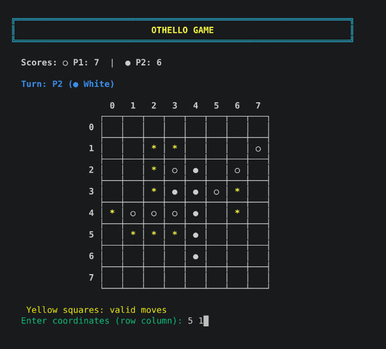

# 🎲 Othello (Reversi) — Terminal Game in C

[](LICENSE)
[](https://github.com/amirmohammadshir1386-web/Othello/actions/workflows/main.yml)


A classic **Othello** board game implemented in C, playable directly in the terminal with colored output.
Two players take turns placing discs and flipping the opponent's pieces.
The game features a clean menu, in-game instructions, and visual highlighting of valid moves.

> 📚 Originally built as a course project for **Fundamentals of Programming (مبانی برنامه‌نویسی)**. The project is feature-complete and not under active development by me, but it's open source — feel free to fork it, learn from it, or extend it.

<!-- Optional: add a real screenshot of the game running in your terminal.
     Save it as docs/screenshot.png and uncomment the line below.
<p align="center"></p>
-->

## Table of Contents

- [Features](#features)
- [Getting Started](#getting-started)
  - [Prerequisites](#prerequisites)
  - [Compilation](#compilation)
  - [Running the Game](#running-the-game)
- [How to Play](#how-to-play)
- [Code Structure](#code-structure)
- [Ideas for Extending This Project](#ideas-for-extending-this-project)
- [Contributing](#contributing)
- [Security](#security)
- [License](#license)

## Features

- 🎮 Two-player local mode
- 🎨 Colored terminal interface (supports ANSI escape codes)
- 📋 Game menu with options: Start Game, Instructions, Exit
- ✨ Visual display of the 8×8 board with Unicode discs
- 🟡 Valid moves highlighted in yellow
- 📊 Live score tracking during gameplay
- 🔄 Automatic passing when no moves are available
- 🏆 Winner announcement with final scores
- 🛡️ Robust input validation and buffer clearing

## Getting Started

### Prerequisites
- GCC compiler (or any C compiler)
- Terminal that supports ANSI colors (Linux/macOS default; Windows Terminal or CMD with ANSI enabled)

### Compilation
Clone the repository and compile the code:
```bash
git clone https://github.com/amirmohammadshir1386-web/Othello.git
cd Othello
gcc othello-v1.c -o othello
```

### Running the Game
```bash
./othello
```
On Windows (if compiled with MinGW):
```bash
othello.exe
```

## How to Play
- Choose **1** from the menu to start a game.
- Enter names for Player 1 (Black ●) and Player 2 (White ○).
- On your turn, enter the row and column coordinates of the square where you want to place a disc (e.g., `2 3`).
- A move is legal only if it traps at least one opponent disc between the new disc and an existing disc of your color.
- All trapped discs are flipped to your color.
- If you have no legal moves, your turn is automatically passed.
- The game ends when the board is full or both players cannot move.
- The player with the most discs wins!

## Code Structure

The game is organized into several functions for clarity:

| Function | Description |
|----------|-------------|
| `initializeGame()` | Sets up the starting board with 4 central discs |
| `printBoard()` | Displays the board with colors and valid move indicators |
| `isValidMove()` | Checks whether a move is legal |
| `flipDiscs()` | Flips opponent discs in all 8 directions after a move |
| `makeMove()` | Places the disc and triggers flipping |
| `hasValidMoves()` | Checks if the current player has any legal move |
| `calculateScore()` | Counts black and white discs |
| `announceWinner()` | Shows the final result |
| `showMenu()` / `showInstructions()` | Displays the main menu and rules |

## Ideas for Extending This Project

This project is complete and I don't plan on releasing new versions myself, but the code is a solid base if you want to practice C or build on it. A few ideas:

- Single-player mode vs. a simple AI
- Save / load game state
- Undo last move
- Split into multiple source files (`board.c`, `game.c`, `ui.c`)
- Improve Windows terminal support without requiring ANSI mode

## Contributing

I'm not actively developing this further, but it's open source — forks, bug reports, and pull requests from others are still welcome. See [CONTRIBUTING.md](CONTRIBUTING.md) for guidelines.

## Security

Found a bug with security implications (e.g. a buffer overflow)? Please see [SECURITY.md](SECURITY.md) for how to report it responsibly instead of opening a public issue.

## License

This project is licensed under the [MIT License](LICENSE) — feel free to fork, modify, and share it.

---

**Enjoy the game!** 🎲
*Made with love in C.*
